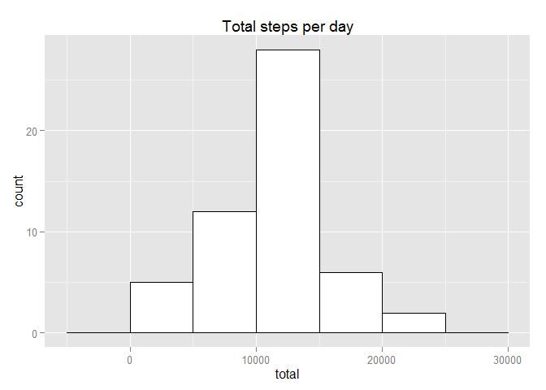
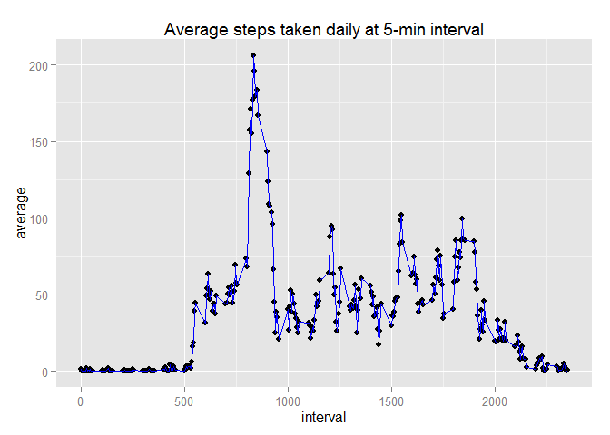
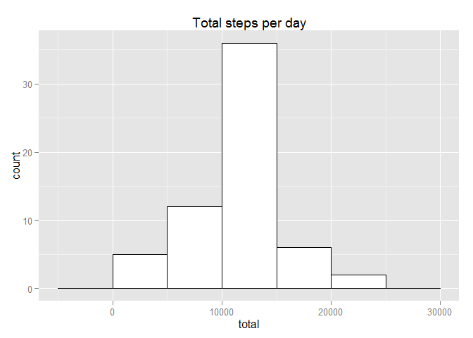
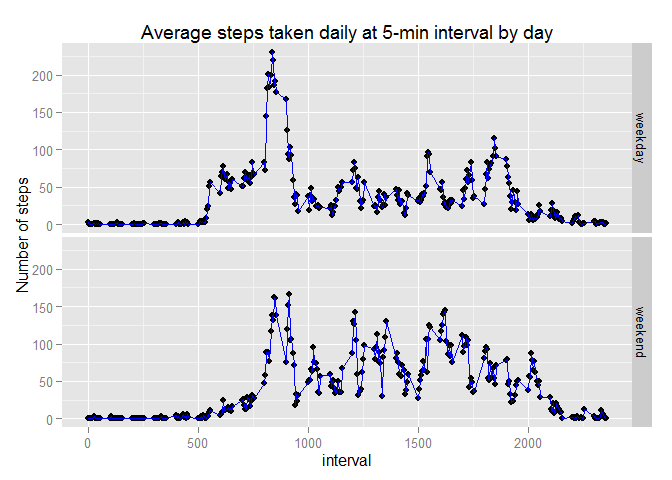

# Reproducible Research: Peer Assessment 1
Johnxz  

## Introduction

It is now possible to collect a large amount of data about personal movement using activity monitoring devices such as a Fitbit, Nike Fuelband, or Jawbone Up. These type of devices are part of the "quantified self" movement - a group of enthusiasts who take measurements about themselves regularly to improve their health, to find patterns in their behavior, or because they are tech geeks. But these data remain under-utilized both because the raw data are hard to obtain and there is a lack of statistical methods and software for processing and interpreting the data.

This assignment makes use of data from a personal activity monitoring device. This device collects data at 5 minute intervals through out the day. The data consists of two months of data from an anonymous individual collected during the months of October and November, 2012 and include the number of steps taken in 5 minute intervals each day.


```r
require(dplyr)
require(ggplot2)
```


## Loading and preprocessing the data

The dataset could be downloaded from the linked provided: 


```r
setwd(".")

if (!file.exists("activity.csv")) {
  temp <- tempfile()
  setInternet2(TRUE)
  dataUrl <- "https://d396qusza40orc.cloudfront.net/repdata%2Fdata%2Factivity.zip"
  download.file(dataUrl,temp)
  unzip(temp) 
  unlink(temp)
} else {
    act <- read.csv("activity.csv")
}
    
head(act, n = 5)
```

```
##   steps       date interval
## 1    NA 2012-10-01        0
## 2    NA 2012-10-01        5
## 3    NA 2012-10-01       10
## 4    NA 2012-10-01       15
## 5    NA 2012-10-01       20
```

The number of observations and variables included in this dataset are:


```r
str(act)
```

```
## 'data.frame':	17568 obs. of  3 variables:
##  $ steps   : int  NA NA NA NA NA NA NA NA NA NA ...
##  $ date    : Factor w/ 61 levels "2012-10-01","2012-10-02",..: 1 1 1 1 1 1 1 1 1 1 ...
##  $ interval: int  0 5 10 15 20 25 30 35 40 45 ...
```

* steps: Number of steps taking in a 5-minute interval (missing values are coded as NA)
* date: The date on which the measurement was taken in YYYY-MM-DD format
* interval: Identifier for the 5-minute interval in which measurement was taken


## What is mean total number of steps taken per day?

The daily activity is presented in the histogram below, showing the distribution of the total number of steps taken each day (ignore the missing values in the dataset):


```r
totalS <-
  act %>%
  group_by(date) %>%
  select(steps) %>%
  summarize(total = sum(steps))

ggplot(totalS, aes(x = total)) +
  geom_histogram(colour = "black", fill = "white", binwidth = 5000) +
  labs(title = "Total steps per day")
```

 

The summary of the daily activity:


```r
print(summary(totalS)); cat("The mean total number of steps taken each day is ",mean(totalS$total, na.rm = TRUE),"\n"); cat("The median total number of steps taken each day is ",median(totalS$total, na.rm = TRUE),"\n")
```

```
##          date        total      
##  2012-10-01: 1   Min.   :   41  
##  2012-10-02: 1   1st Qu.: 8841  
##  2012-10-03: 1   Median :10765  
##  2012-10-04: 1   Mean   :10766  
##  2012-10-05: 1   3rd Qu.:13294  
##  2012-10-06: 1   Max.   :21194  
##  (Other)   :55   NA's   :8
```

```
## The mean total number of steps taken each day is  10766.19
```

```
## The median total number of steps taken each day is  10765
```


## What is the average daily activity pattern?

The average daily activity pattern is demonstated in this time series plot:


```r
totalD <-
  act %>%
  group_by(interval) %>%
  select(steps) %>%
  summarize(average = mean(steps, na.rm = TRUE))

ggplot(data = totalD) +
  geom_point(aes(x = interval, y = average)) +
  geom_line(aes(x = interval, y = average), colour = "blue") +
  labs(title = "Average steps taken daily at 5-min interval")
```

 

The summary of average daily activity pattern is as below:


```r
print(summary(totalD))
```

```
##     interval         average       
##  Min.   :   0.0   Min.   :  0.000  
##  1st Qu.: 588.8   1st Qu.:  2.486  
##  Median :1177.5   Median : 34.113  
##  Mean   :1177.5   Mean   : 37.383  
##  3rd Qu.:1766.2   3rd Qu.: 52.835  
##  Max.   :2355.0   Max.   :206.170
```

The identifier of the 5-minute interval that contains the maximum number of steps (on average across all the days in the dataset) is:


```r
max_int <- totalD[which(totalD$average == max(totalD$average, na.rm = TRUE)), ]
cat("",max_int$interval,", at which the maximum average step number per interval ",max_int$average," was recorded")
```

```
##  835 , at which the maximum average step number per interval  206.1698  was recorded
```


## Imputing missing values

Note that there are a number of days/intervals where there are missing values (coded as NA). The presence of missing days may introduce bias into some calculations or summaries of the data.

The total number of missing values in the dataset (i.e. the total number of rows with NAs) is determinded by function 'is.na':


```r
sum(is.na(act))
```

```
## [1] 2304
```

```r
print(summary(act))
```

```
##      steps                date          interval     
##  Min.   :  0.00   2012-10-01:  288   Min.   :   0.0  
##  1st Qu.:  0.00   2012-10-02:  288   1st Qu.: 588.8  
##  Median :  0.00   2012-10-03:  288   Median :1177.5  
##  Mean   : 37.38   2012-10-04:  288   Mean   :1177.5  
##  3rd Qu.: 12.00   2012-10-05:  288   3rd Qu.:1766.2  
##  Max.   :806.00   2012-10-06:  288   Max.   :2355.0  
##  NA's   :2304     (Other)   :15840
```

The strategy we employed here for filling in all of the missing step values in the dataset (all missing values in this dataset are step values as shown above) is to replace it with the mean step number for that 5-minute interval. A new dataset that is equal to the original dataset but with the missing data filled in was created as below:


```r
act1 <- act %>%
  group_by(interval) %>%
  mutate_each(funs(ifelse(is.na(.), mean(., na.rm = TRUE), .)) )

new_act <- as.data.frame(act1)
act$date <- as.Date(act$date)
new_act$date <- as.Date(act$date)

head(new_act)
```

```
##       steps       date interval
## 1 1.7169811 2012-10-01        0
## 2 0.3396226 2012-10-01        5
## 3 0.1320755 2012-10-01       10
## 4 0.1509434 2012-10-01       15
## 5 0.0754717 2012-10-01       20
## 6 2.0943396 2012-10-01       25
```

```r
cat("To check if there is still any missing values by is.na funturn returns",any(is.na(new_act)),"")
```

```
## To check if there is still any missing values by is.na funturn returns FALSE
```

The re-calaulated total number of steps taken each day and the mean and median total number of steps taken per day, with missing value filled, are as below. 


```r
totalS_new <-
  new_act %>%
  group_by(date) %>%
  select(steps) %>%
  summarize(total = sum(steps))

ggplot(totalS_new, aes(x = total)) +
  geom_histogram(colour = "black", fill = "white", binwidth = 5000) +
  labs(title = "Total steps per day")
```

 

```r
print(summary(totalS_new)); cat("The mean total number of steps taken each day is ",mean(totalS_new$total),"\n"); cat("The median total number of steps taken each day is ",median(totalS_new$total),"\n")
```

```
##       date                total      
##  Min.   :2012-10-01   Min.   :   41  
##  1st Qu.:2012-10-16   1st Qu.: 9819  
##  Median :2012-10-31   Median :10766  
##  Mean   :2012-10-31   Mean   :10766  
##  3rd Qu.:2012-11-15   3rd Qu.:12811  
##  Max.   :2012-11-30   Max.   :21194
```

```
## The mean total number of steps taken each day is  10766.19
```

```
## The median total number of steps taken each day is  10766.19
```

After imputing missing data, the mean/median values don't differ from the estimates from the first part of the assignment much, however, the distribution of the total daily number of steps is more centralized around the average of daily total.


## Are there differences in activity patterns between weekdays and weekends?

First a new factor variable "day' in the dataset with two levels -- "weekday" and "weekend" indicating whether a given date is a weekday or weekend day -- can be ctreated use 'factor' and 'weekdays' functions in package 'base'. Then functions in 'dplyr' are used to group step number data by a combination of variables 'interval' and 'day', and to calculate the average number of steps taken, averaged across all weekday days or weekend days. Then a panel plot containing a time series plot (i.e. type = "l") of the daily activity at 5-minute interval can be plotted. There seems to be more daytime activity during the weekend: 


```r
new_act$day <- factor((weekdays(new_act$date) %in% c("Saturday", "Sunday")),
                      levels = c(FALSE, TRUE), 
                      labels = c("weekday", "weekend"))

total_day <-
  new_act %>%
  group_by(interval, day) %>%
  select(steps) %>%
  summarize(average = mean(steps, na.rm = TRUE))

head(total_day)
```

```
## Source: local data frame [6 x 3]
## Groups: interval
## 
##   interval     day    average
## 1        0 weekday 2.25115304
## 2        0 weekend 0.21462264
## 3        5 weekday 0.44528302
## 4        5 weekend 0.04245283
## 5       10 weekday 0.17316562
## 6       10 weekend 0.01650943
```

```r
ggplot(data = total_day) +
  geom_point(aes(x = interval, y = average)) +
  geom_line(aes(x = interval, y = average), colour = "blue") +
  facet_grid(day ~ .) +
  labs(title = "Average steps taken daily at 5-min interval by day", y = "Number of steps")
```

 


